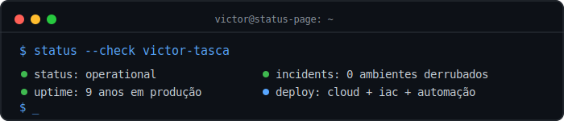
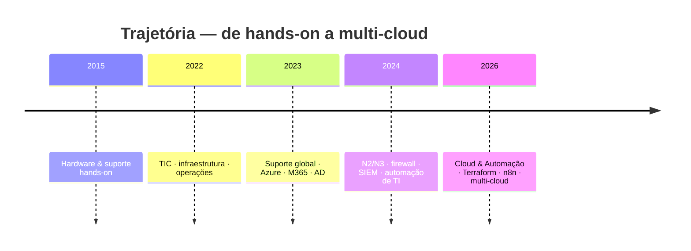

<div align="center">



<br/>

# 🟢 victor-tasca `/ status-page`

**Analista de Cloud & Automação** — Castelo Branco, PT
Monitorando infraestrutura crítica desde 2015. Zero downtime aceitável.

<a href="https://www.linkedin.com/in/victor-tasca"></a>
<a href="https://github.com/Victortascaa"></a>


</div>

<br/>

## 📟 System Status

```diff
+ Azure ............... operational
+ AWS .................. operational
+ Oracle Cloud ......... operational
+ Terraform (IaC) ...... operational
+ n8n / automação ...... operational
+ pfSense / VPN ........ operational
+ SIEM (Wazuh) ......... monitoring
! trabalho manual ...... deprecated — sunset em progresso
```

<br/>

## 🔍 Root Cause Analysis (por que eu automatizo diferente)

A maioria dos profissionais de automação parte da superfície: veem um processo repetitivo e o transformam em script. Eu não.

Antes de escrever a primeira linha de Terraform, eu **sustentei** o que estava por trás — AD, M365, firewall, VPN, SIEM. Isso significa que quando eu automatizo, eu já sei onde o processo pode quebrar, porque já fui eu quem apagou o incêndio às 3h da manhã.

```text
outros:  processo manual → identifica dor → automatiza
eu:      diagnostico → penso em IAM/custo/governança → aí sim, automatizo
```

<br/>

## 🧰 Stack (component health)

<div align="center">

| Camada | Componentes |
|---|---|
| **☁️ Cloud** |    |
| **🏗️ IaC** |  |
| **⚙️ Automação** |    |
| **🔐 Identity** |     |
| **🛡️ Security** |    |

</div>

<br/>

## 📈 Postmortem: linha do tempo de incidentes resolvidos (a.k.a. carreira)



> Formação: **Análise e Desenvolvimento de Sistemas** (UniMetrocamp) · Técnico em Manutenção e Suporte (Senac-SP)

<br/>

## 🚀 Deployments em destaque

| Repositório | Descrição |
|---|---|
| [**projeto_noticias_telegram**](https://github.com/Victortascaa/projeto_noticias_telegram) | Scraping + monitoramento + Telegram para rádios FM (Python) |
| [**vaultscore-mvp**](https://github.com/Victortascaa/vaultscore-mvp) | Experimento em TypeScript |
| [**aether-empires**](https://github.com/Victortascaa/aether-empires) | Experimento em TypeScript |
| [**Betel-APP**](https://github.com/Victortascaa/Betel-APP) | App React Native (projeto de faculdade) |
| [**Trabalho-de-Extens-o-Python01**](https://github.com/Victortascaa/Trabalho-de-Extens-o-Python01) | App voluntário para pequena comerciante |

<br/>

## 💬 Incident response policy

```text
> não automatizo caos.
> primeiro estabilizo o ambiente.
> depois — e só depois — transformo processo em pipeline.
```

Se você precisa de alguém que liga **Cloud + IaC + Automação** sem perder o chão da infraestrutura, abre um chamado 👇

<div align="center">

<a href="https://www.linkedin.com/in/victor-tasca">
  
</a>
&nbsp;
<a href="https://github.com/Victortascaa">
  
</a>

<br/>

```text
$ tail -f victor.log
[OK] sempre construindo o próximo playbook
```

</div>
